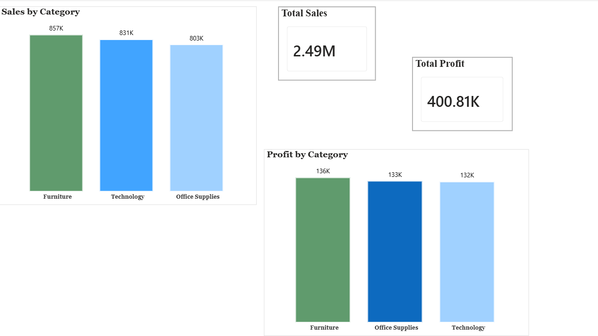
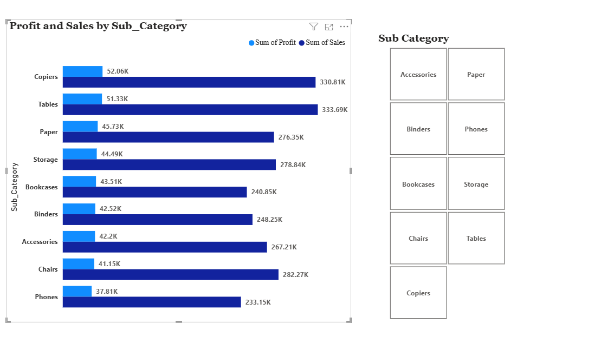
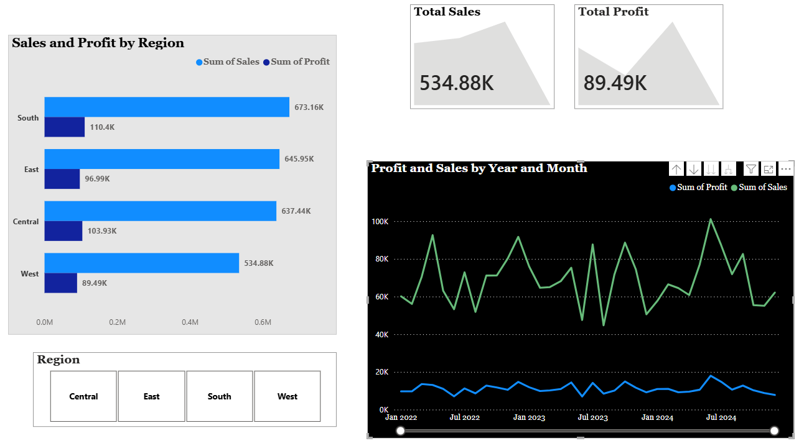
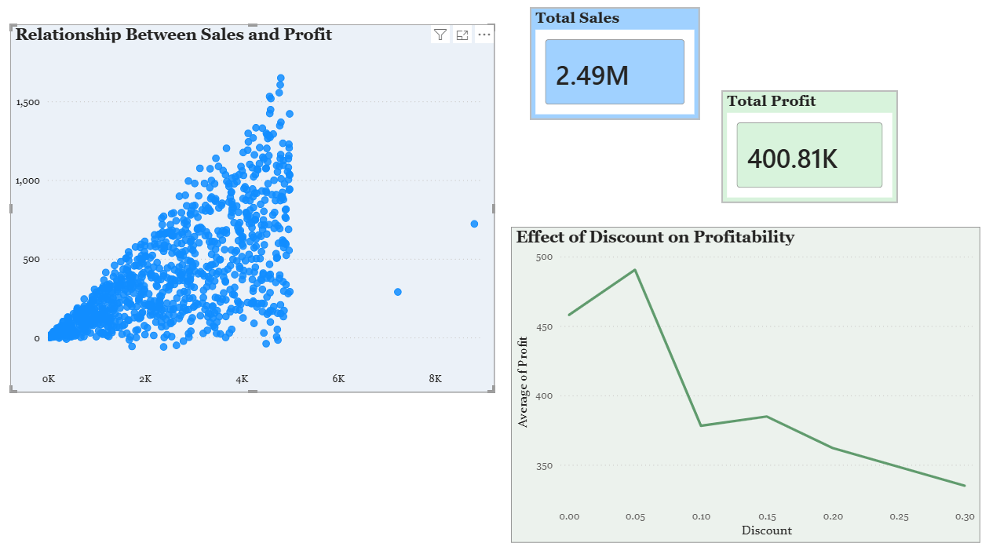
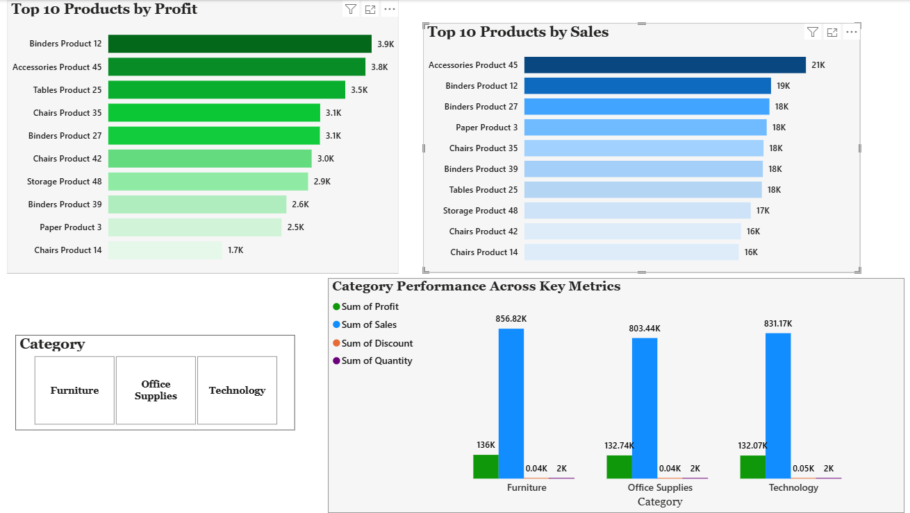

# 📊 Superstore Sales Analysis

## 🌟 Project Overview
This project analyzes Superstore sales data using Python to identify sales trends, profitability, product performance, and business insights.

---

## 🛠️ Tools Used
- Python
- Pandas
- NumPy
- Matplotlib
- Seaborn

---

## 🎯 Business Questions
- Which category generates the highest sales?
- Which category is the most profitable?
- How does discount affect profit?
- What is the relationship between sales and profit?
- Which products are top performers?

---

## 📂 Files
- Sales and Profit Analysis of Global Superstore (1).ipynb

---

## 📈 Key Insights
- Furniture generated highest sales overall
- Sales and profit are strongly related
- Higher discounts reduce profitability
- Few products contribute major sales
- Category performance varies significantly across metrics

---

## 📸 Dashboard Preview

### Category Wise Sales & Profit

### Subcategory Wise Profit

### Region Analysis

### Sales vs Discount Relationship

### Top Products

